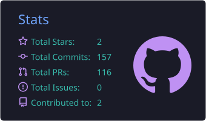
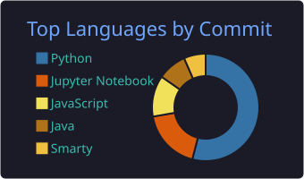

<div align="center">
  

[](https://git.io/typing-svg)
</div>

---

```bash
$ whoami
```
```
Name     : David Peña
Role     : Senior Software Engineer & Architect
Location : Bogotá, Colombia 🇨🇴
Focus    : Backend systems · Cloud architecture · FinOps
Studying : MSc Engineering Management @ Universidad de los Andes
Hobbies  : Pets 🐶🐱 · Caribbean escapes 🏝️ · Open Source · Rust 🦀
```

---

```bash
$ skills --overview
```
```
Backend      Python · Go · REST · gRPC · Event-driven architectures
Cloud        AWS · GCP · Multi-cloud environments
Infra        CI/CD · Docker · Kubernetes · IaC
Databases    SQL · NoSQL · In-memory caching · Message queues
Now learning Rust 🦀  (because performance matters)
```

---

```bash
$ cat /var/log/experience.log
```
```
  E-Commerce & FinTech       LatAm's largest digital platform (94M+ buyers)
                             Platform stability at scale · Technical consulting
                             High-impact incident resolution · Engineering mentorship

  PropTech                   Real estate unicorn ($521M raised)
                             Property data platforms · Geolocation systems
                             Loan management · Risk consulting applications

  Data & Banking             Hybrid cloud consulting for the banking sector
                             Data security · PII & transaction masking
                             Enterprise data lakes & analytics pipelines

  FinTech / Alt. Lending     3M+ loans granted across Latin America
                             Credit solutions for unbanked individuals & SMEs

  IT & Cloud Consulting      Application modernization at enterprise scale
                             Multi-cloud FinOps · Event-driven architectures

  Logistics & Supply Chain   Last-mile delivery automation across LatAm
                             GPS tracking · Supplier data integration
```

---

```bash
$ cat services.txt
```
```
┌───────────────────────────────────────────────────────────────┐
│             Available for freelance & consulting              │
├───────────────────────────────────────────────────────────────┤
│  🐍  Backend Development    APIs, services & integrations     │
│                             Python · Go · REST · gRPC         │
│                                                               │
│  🌐  Web Optimization       Landing pages · Performance       │
│                             Conversion-focused · SEO-ready    │
│                                                               │
│  🐛  Bug Hunting            Debugging · Root cause analysis   │
│                             Code review · Legacy systems      │
│                                                               │
│  📐  Technical Consulting   Architecture reviews · FinOps     │
│                             Web services advisory · Roadmaps  │
└───────────────────────────────────────────────────────────────┘
  → Let's build something great: linkedin.com/in/davisfelipe
```

---

```bash
$ github-stats --user davisfelipe
```

<div align="center">
  
  
</div>

---

```bash
$ github-activity --contributions
```

<div align="center">
  <picture>
    <source media="(prefers-color-scheme: dark)" srcset="https://raw.githubusercontent.com/davisfelipe/davisfelipe/output/github-contribution-grid-snake-dark.svg" />
    <source media="(prefers-color-scheme: light)" srcset="https://raw.githubusercontent.com/davisfelipe/davisfelipe/output/github-contribution-grid-snake.svg" />
    
  </picture>
</div>

---

```bash
$ ./contact.sh --open
```

<div align="center">

<a href="https://www.linkedin.com/in/davisfelipe/">
  
</a>
<a href="https://www.instagram.com/davis_felipe">
  
</a>

</div>
